# Linux Shell Scripting
# Table of Contents

1. [Introduction to Linux Shell Scripting](#introduction-to-linux-shell-scripting)
   - [Objective](#objective)
   - [What is Linux Shell Scripting?](#what-is-linux-shell-scripting)
   - [Importance of Linux Shell Scripting](#importance-of-linux-shell-scripting)
2. [Setting Up Your Environment](#setting-up-your-environment)
   - [Accessing the Terminal](#accessing-the-terminal)
   - [Installing Necessary Packages](#installing-necessary-packages)
3. [Basic Shell Commands](#basic-shell-commands)
   - [Navigating the File System](#navigating-the-file-system)
   - [File Operations](#file-operations)
   - [Viewing File Contents](#viewing-file-contents)
4. [Writing Your First Shell Script](#writing-your-first-shell-script)
   - [Creating a Shell Script](#creating-a-shell-script)
   - [Making the Script Executable](#making-the-script-executable)
   - [Running the Script](#running-the-script)
5. [Variables in Shell Scripts](#variables-in-shell-scripts)
   - [Definition](#definition)
   - [Environment Variables](#environment-variables)
   - [Arithmetic Operations](#arithmetic-operations)
6. [Conditional Statements](#conditional-statements)
   - [If-Else Statements](#if-else-statements)
   - [Elif for Multiple Conditions](#elif-for-multiple-conditions)
7. [Loops in Shell Scripts](#loops-in-shell-scripts)
   - [For Loop](#for-loop)
   - [While Loop](#while-loop)
   - [Until Loop](#until-loop)
8. [Functions in Shell Scripts](#functions-in-shell-scripts)
   - [Defining and Calling Functions](#defining-and-calling-functions)
   - [Function with Return Values](#function-with-return-values)
9. [Working with Files and Directories](#working-with-files-and-directories)
   - [Reading from a File](#reading-from-a-file)
   - [Writing to a File](#writing-to-a-file)
10. [Error Handling](#error-handling)
   - [Exit Status and Error Checking](#exit-status-and-error-checking)

## 1. Introduction to Linus Shell Scripting
### Objective
Welcome to the comprehensive guide to Linux Shell Scripting! This guide is designed for beginners and intermediate users who wish to manage system, streamline workflows and automating tasks using shell scripts. By the end of this guide, you will be more equipped with  required skills to create, execute, and debugging basic to advanced shell scripts. 

### What is Linux Shell Scripting?
Linux shell scripting is the process of writing and executing multiple lines of instructions in a shell to automate the target task or achieve a purpose. The shell script is usually a command-line interface used in Unix-like operating systems, such as Ubuntu, CentOS, etc. It is a text file containing a sequence of commands to execute. 

### Importance of Linux Shell Scripting
- **Automation**: Automate repetitive tasks and improve efficiency.
- **System Management**: Manage users, processes, and system operations.
- **Custom Solutions**: Develop custom tools tailored to specific needs.

## 2. Setting Up Your Environment
### Accessing the Terminal
You can access the terminal depending on your choice of operating system. 

- **Linux**: Open the terminal using `Ctrl + Alt + T` or search for "Terminal" in the applications menu.
- **macOS**: Use `Cmd + Space`, type "Terminal," and hit Enter.
- **Windows**: Install Windows Subsystem for Linux (WSL) and use the terminal provided by your chosen Linux distribution (e.g., Ubuntu) or install Git Bash.

### Installing Necessary Packages
To ensure a good working shell for Windows, install WSL and Ubuntu or any other distribution:

`sudo apt update`
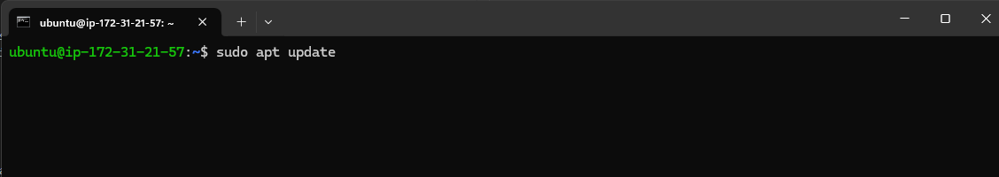

`sudo apt install bash`
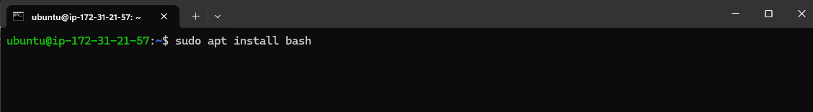

## 3. Basic Shell Commands
### Navigating the File System
- `pwd` - Print working directory.
- `ls` - List files in the current directory.
- `cd` - Change directory.

### File Operations
- `touch filename` - Create an empty file.
- `cp source destination` - Copy files.
- `mv source destination` - Move/rename files.
- `rm filename` - Remove files.

### Viewing File Contents
- `cat filename` - Display file contents.
- `less filename` - View file contents with navigation.
- `head filename` - View the first 10 lines.
- `tail filename` - View the last 10 lines.

You can find more details in the [Essential Linux Commands section](https://github.com/kanmyng/DevOps-Project/tree/main/01.Essential-Linux-Commands) of the repository.

## 4. Writing Your First Shell Script

### Creating a Shell Script
1. Create a new file, e.g., `hello-world.sh`.

2. Confirm the `hello-world.sh` file.

3. Open your text editor (e.g., nano, vim).

4. Add the following content and save:

`echo "Hello, World!"`
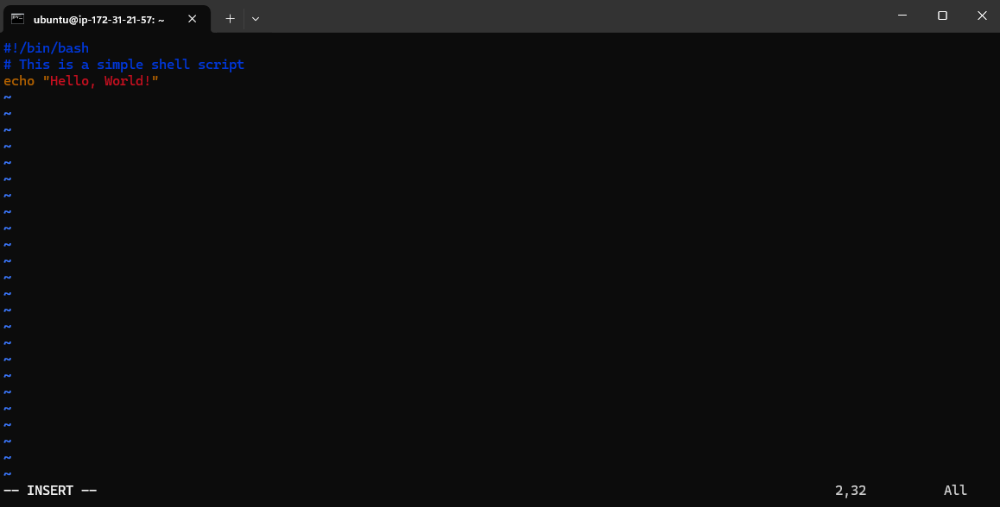

Note: Your shell script file must begin with `#!/bin/bash`. This line, known as a shebang, ensures that the script is executed correctly by specifying the Bash interpreter.

### Making the Script Executable
To ensure the script can be run, it is essential to make it executable by granting the necessary execute permissions:

`chmod +x hello-world.sh`

The screenshot below shows an attempt to run a shell script without executable permissions, resulting in a "Permission denied" error.

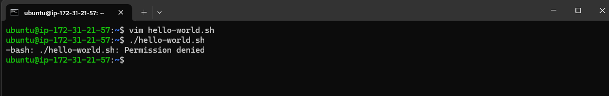

### By running `./hello-world.sh`, you instruct the shell to execute the `hello-world.sh` script from the current directory.

`./:`  
Specifies the current directory, ensuring the shell runs the script found in that directory.

`hello-world.sh`:  
The name of the script file you want to execute.

To make a file executable, the commands shown in the screenshot are:

Use `chmod +x hello-world.sh`

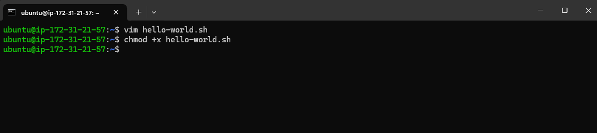

### Running the Script

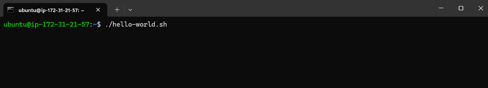

To run the `hello-world.sh` script in the current directory, use `./hello-world.sh`. The `./` tells the shell to look in the current working directory.

The below screenshot shows the result of executing the `hello-world.sh` file.

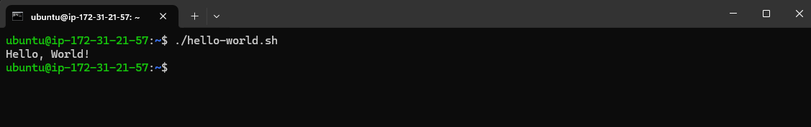

## 5. Variables in Shell Scripts

### Definition
Variables are like containers used to store and operate on data, such as assigning a value to a name. There are no data types in shell scripting; the value of the variable is treated as a string, even if it's a number.

**Syntax:**  
`VARIABLE_NAME=value`

### Key Points to Remember:

i. There are no spaces around the `=` sign.

ii. Variable names are case-sensitive, and they are typically written in uppercase to differentiate them from other elements in the script.

The screenshot below shows the script file being edited with a variable.

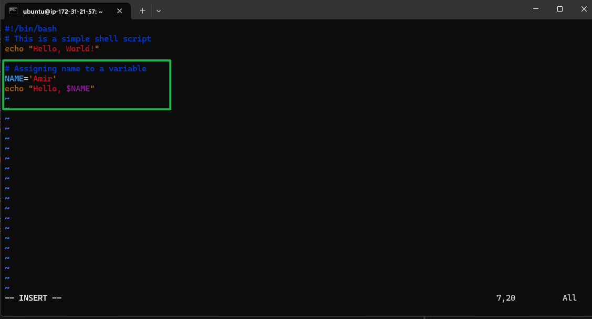

The screenshot below demonstrates the execution of a variable name.

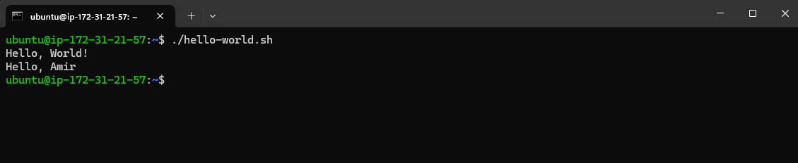

### Environment Variables

The screenshot below demonstrates the environment variable.

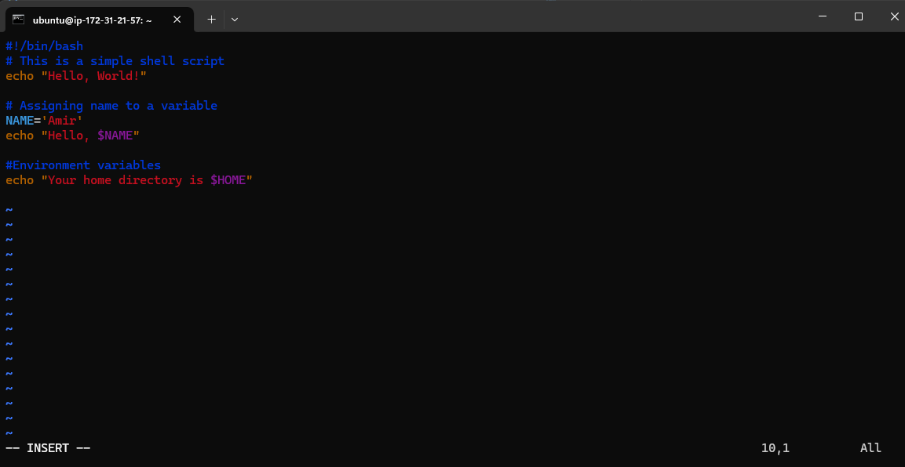

Variables are like a container used to store and operate on data, such as assigning a value to a name. There are no data types in shell scripting, but the value of the variable is treated as a string, even if it's a number.

**Syntax:**  
`VARIABLE_NAME=value`

### Key Points to Remember:

i. There are no spaces around the `=` sign.

ii. Variable names are case-sensitive, and they are typically written in uppercase to differentiate them from other elements in the script.

The screenshot below shows the script file being edited with a variable.

The screenshot below demonstrates the execution of a variable name.

### Environment Variables

The screenshot below demonstrates the environment variable.

The screenshot below demonstrates the execution.

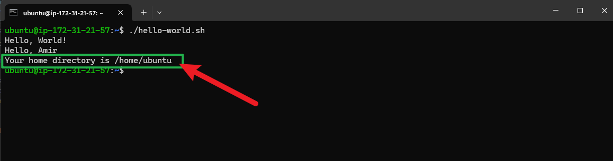

### Arithmetic Operations

The screenshot below shows the bash script that calculates the sum of two numbers.

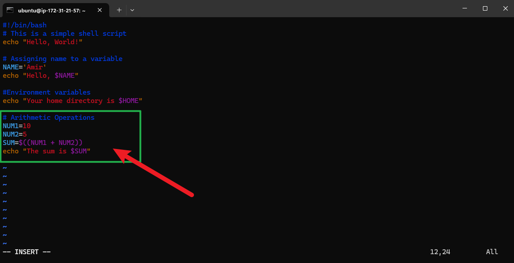

The screenshot below shows the result.

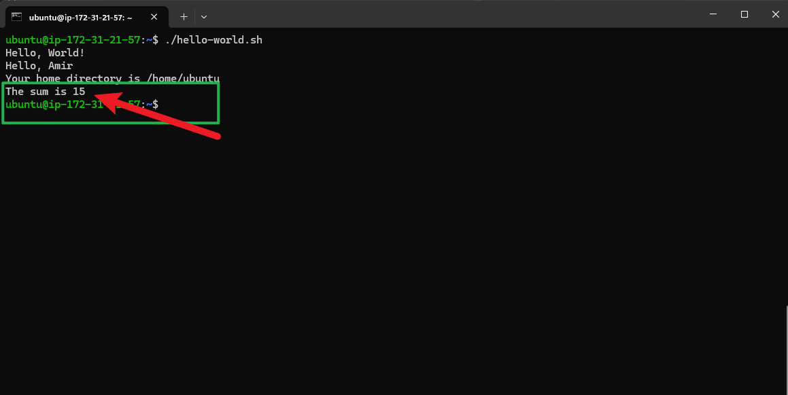

### Here's a Breakdown of Each Line:

`NUM1=10`:  
This line defines a variable named `NUM1` and assigns it the value 10.

`NUM2=5`:  
The second line defines another variable named `NUM2` and assigns it the value 5.

`SUM=$((NUM1 + NUM2))`:  
This line calculates the sum of `NUM1` and `NUM2`. The `$((...))` syntax is used for arithmetic operations in Bash. The result of the addition is then stored in the variable `SUM`.

`echo "The sum is $SUM"`:  
This line prints the result to the terminal. The `echo` command outputs the text within the quotation marks, and `$SUM` is replaced with the value stored in the `SUM` variable. So, it will display: `The sum is 15`.

## 6. Conditional Statements

### i. If-Else Statements

The screenshot below shows the `If-Else` statements.

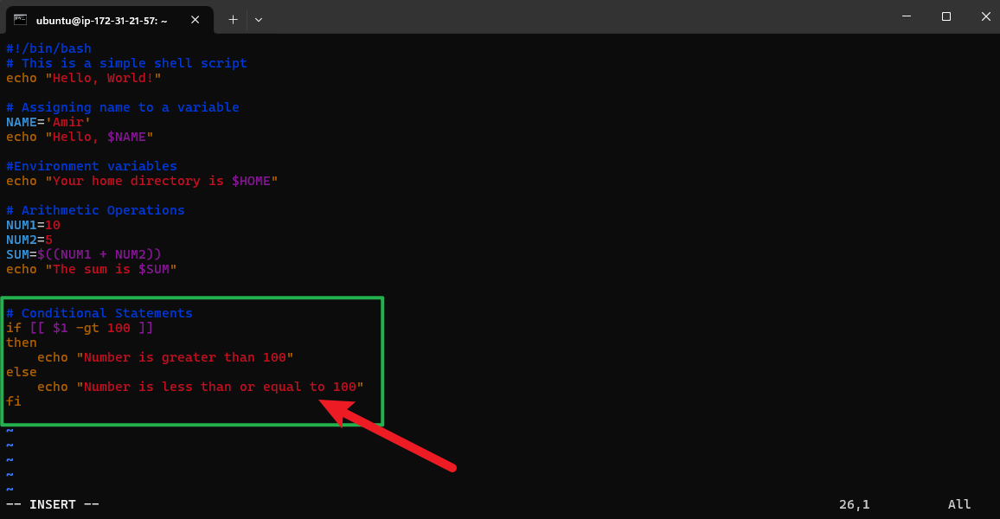

### Here's a Breakdown of Each Line of `If-Else`:

`if [ $1 -gt 100 ]`:  
Checks if the first argument (`$1`) is greater than 100.

`then`:  
Begins the block of code to execute if the condition is true.

`echo "Number is greater than 100"`:  
Prints a message if the condition is true.

`else`:  
Begins the block of code to execute if the condition is false.

`echo "Number is less than or equal to 100"`:  
Prints a message if the condition is false.

`fi`:  
Ends the `if` statement block, which is a reverse of `if`.

The screenshot below shows the output of the `if-else` statement.

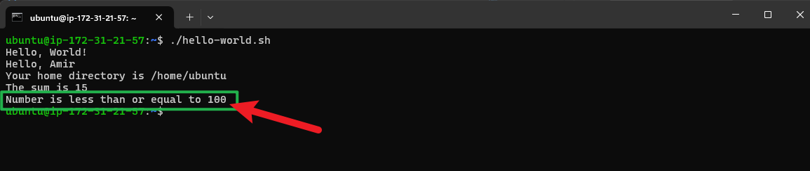

### ii. Elif for Multiple Conditions

The screenshot below shows the `Elif` statements for multiple conditions.

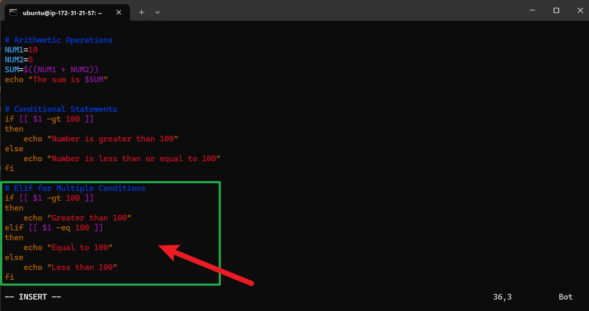

### Here's a Breakdown of Each Line of `Elif`:

`if [ $1 -gt 100 ]`:  
Checks if the first argument (`$1`) is greater than 100.

`then`:  
Starts the block of code to execute if the condition is true.

`echo "Greater than 100"`:  
Prints a message if `$1` is greater than 100.

`elif [ $1 -eq 100 ]`:  
Checks if the first argument (`$1`) is equal to 100.

`then`:  
Starts the block of code to execute if the second condition is true.

`echo "Equal to 100"`:  
Prints a message if `$1` is equal to 100.

`else`:  
Starts the block of code to execute if both conditions are false.

`echo "Less than 100"`:  
Prints a message if `$1` is less than 100.

`fi`:  
Ends the `if-elif-else` statement block, which is a reverse of `if`.

The screenshot below shows the output of the `Elif` statement.

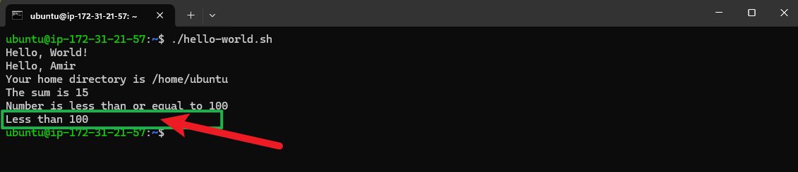

## 7. Loops in Shell Scripts

### i. For Loop

The screenshot below shows the `For Loop` statement.

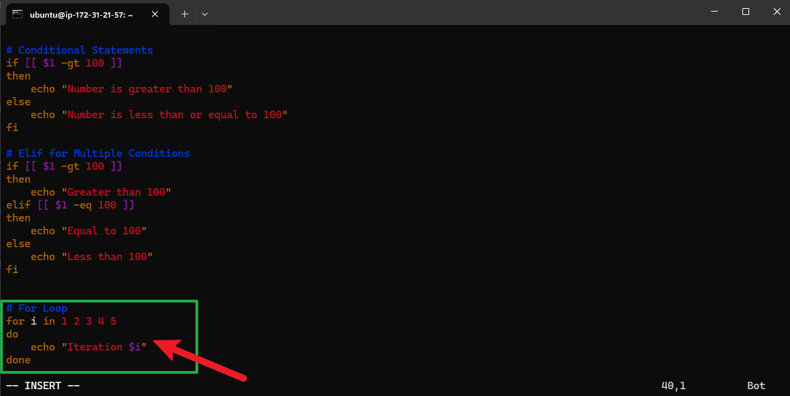

### Here's a Breakdown of Each Line of `For Loop`:

`for i in 1 2 3 4 5`:  
Loops through each number (`i`) from 1 to 5.

`do`:  
Begins the loop's block of code.

`echo "Iteration $i"`:  
Prints the current iteration number (`$i`).

`done`:  
Ends the loop.

The screenshot below shows the output of the `For Loop`.

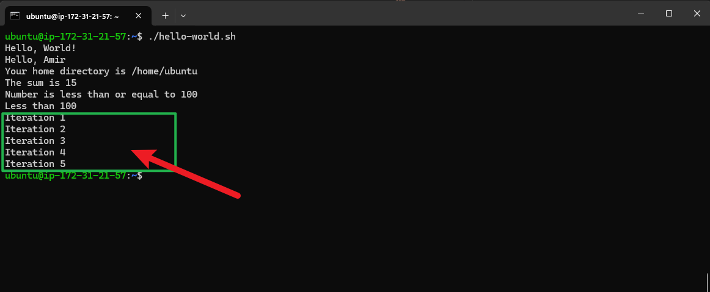

### ii. While Loop

The screenshot below shows the `While Loop`.

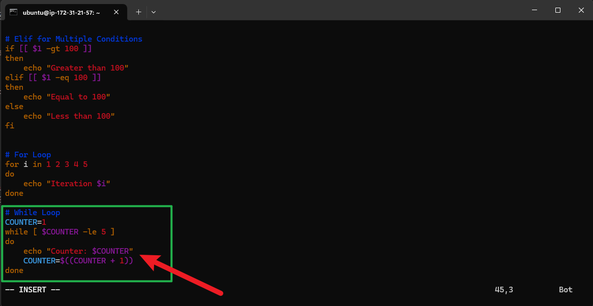

### Here's a Breakdown of Each Line of `While Loop`:

`COUNTER=1`:  
Initializes the variable `COUNTER` with a value of 1.

`while [ $COUNTER -le 5 ]`:  
Begins a loop that continues as long as `COUNTER` is less than or equal to 5.

`do`:  
Starts the block of code to execute within the loop.

`echo "Counter: $COUNTER"`:  
Prints the current value of `COUNTER`.

`COUNTER=$((COUNTER + 1))`:  
Increments `COUNTER` by 1.

`done`:  
Ends the loop.

The screenshot below shows the output of the `While Loop`.

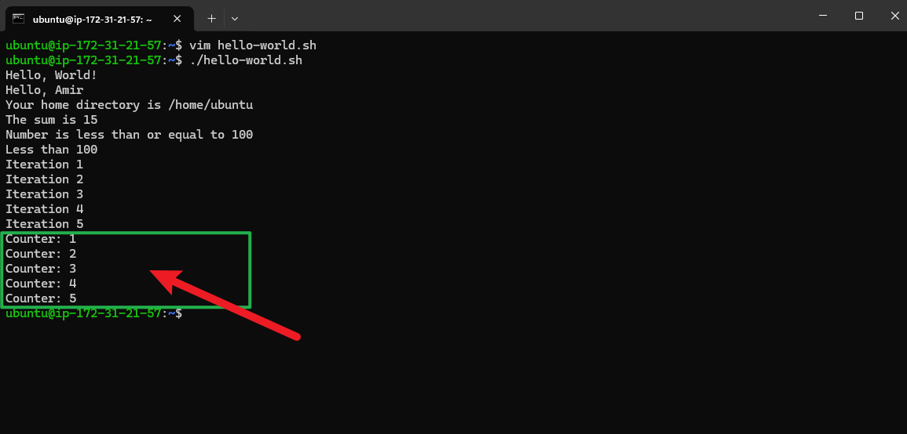

### iii. Until Loop

The screenshot below shows the `Until Loop` statement.

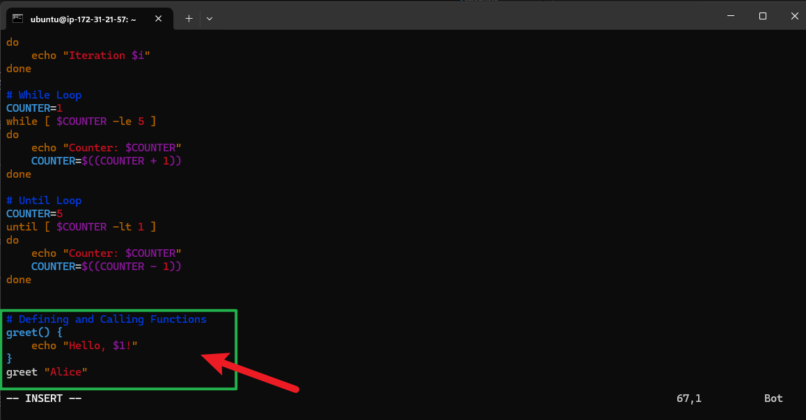  
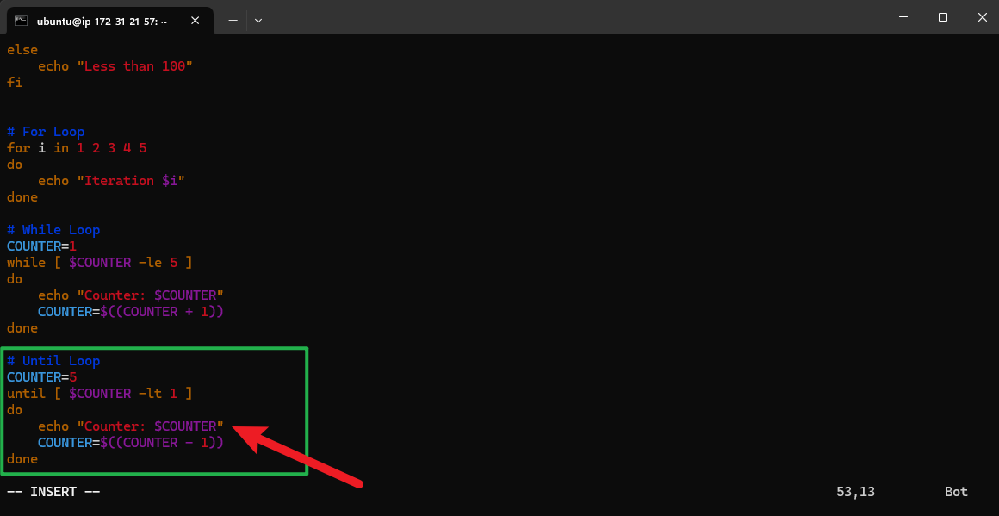

### Here's a Breakdown of Each Line of `Until Loop`:

`COUNTER=5`:  
Initializes the variable `COUNTER` with a value of 5.

`until [ $COUNTER -lt 1 ]`:  
Starts a loop that continues until `COUNTER` is less than 1.

`do`:  
Begins the block of code to execute within the loop.

`echo "Counter: $COUNTER"`:  
Prints the current value of `COUNTER`.

`COUNTER=$((COUNTER - 1))`:  
Decreases `COUNTER` by 1.

`done`:  
Ends the loop.

The screenshot below shows the output of the `Until Loop`.

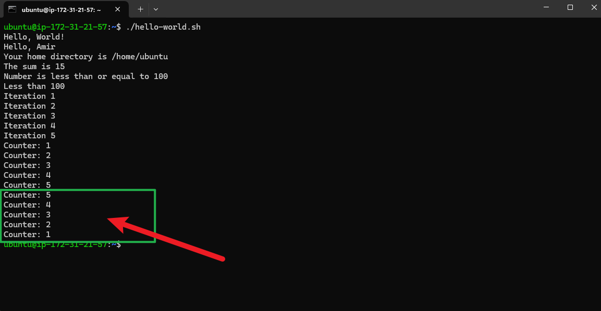

## 8. Functions in Shell Scripts

### i. Defining and Calling Functions

The screenshot below shows the `Defining and Calling Functions`.

### Here's a Breakdown of Each Line of Defining and Calling Functions:

`greet() {`:  
Defines a function named `greet`.

`echo "Hello, $1!"`:  
Prints "Hello," followed by the first argument (`$1`) passed to the function.

`}`:  
Closes the function definition.

`greet "Alice"`:  
Calls the `greet` function with "Alice" as the argument, printing "Hello, Alice!"

The screenshot below shows the output of the `Defining and Calling Functions`.

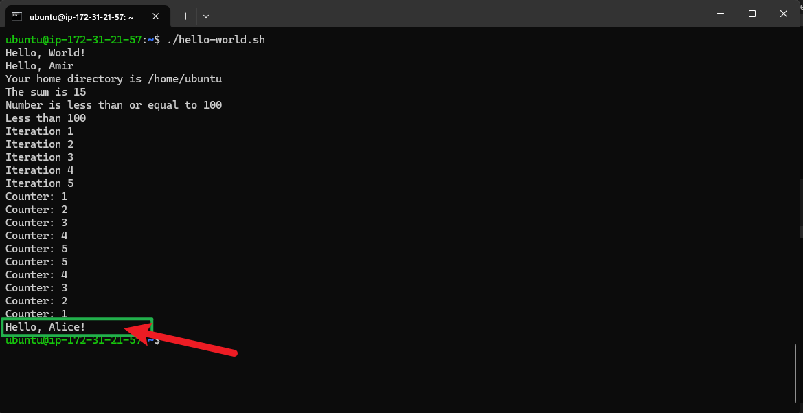

### ii. Function with Return Values

The screenshot below shows the `Function with Return Values`.

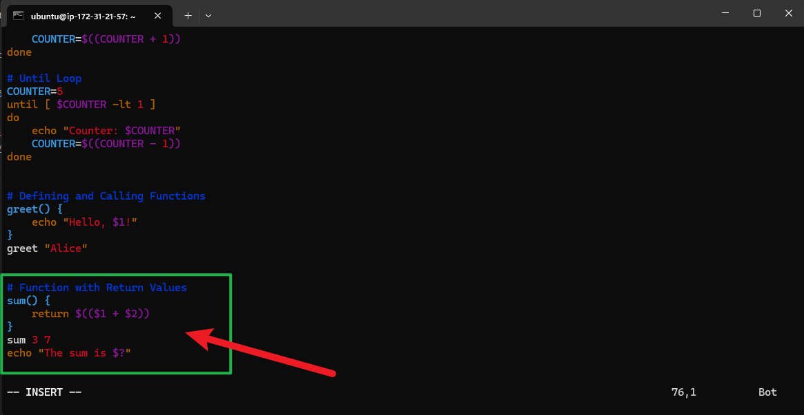

**Here's a Breakdown of Each Line of Function with Return Values:**

`sum() {`:  
Defines a function named `sum`.

`return $(($1 + $2))`:  
Returns the sum of the first and second arguments (`$1 + $2`).

`}`:  
Closes the function definition.

`sum 3 7`:  
Calls the `sum` function with arguments 3 and 7.

`echo "The sum is $?"`:  
Prints "The sum is" followed by the exit status of the last command, which is the sum returned by the function (10).

The screenshot below shows the output of the `Function with Return Values`.

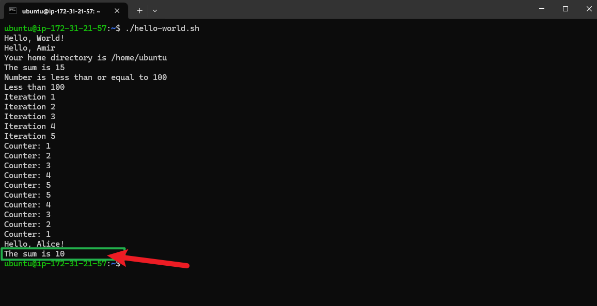

## 9. Working with Files and Directories.
#### i. Reading from a File
The below screenshot is the Reading from a file statement.
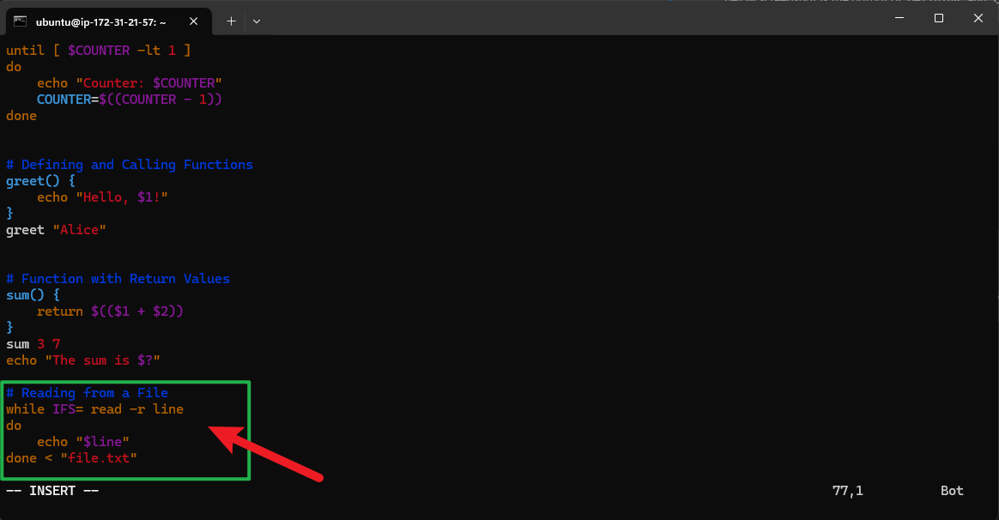

### Here's a breakdown of each line of reading from a file statement:
while IFS= read -r line: 
Starts a loop that reads each line from file.txt into the variable line, preserving whitespace (IFS=) and backslashes (-r).

do: 
Begins the block of code to execute for each line.

echo "$line": 
Prints the current line.

done < "file.txt": 
Redirects file.txt as input to the while loop.

The below screenshot is the writing from a file.txt.
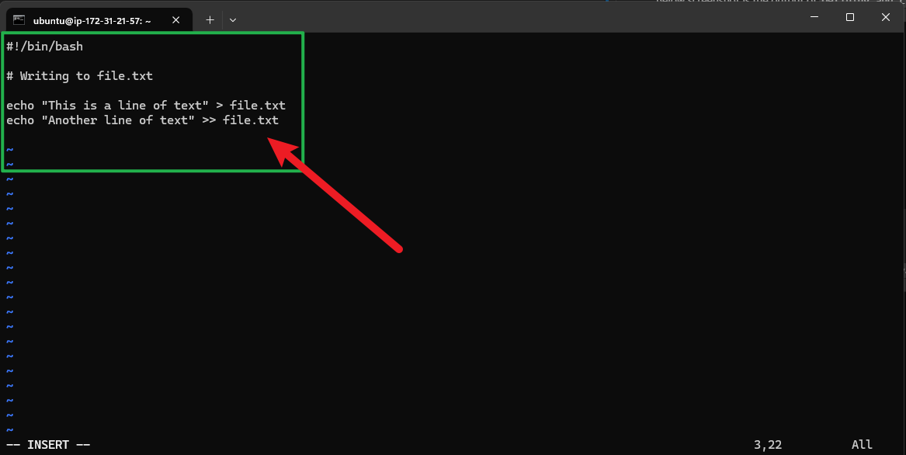

The below screenshot is the output of reading to a file.txt.
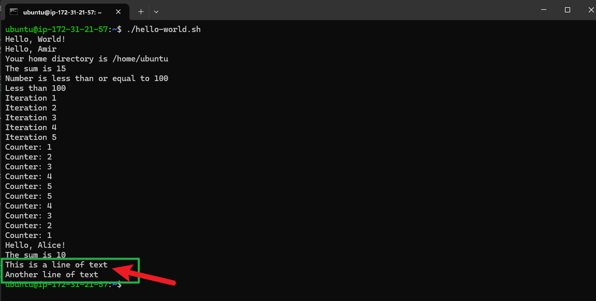

## 10. Error Handling
### i. Exit Status and Error Checking
The below screenshot is the Exit Status and Error Checking
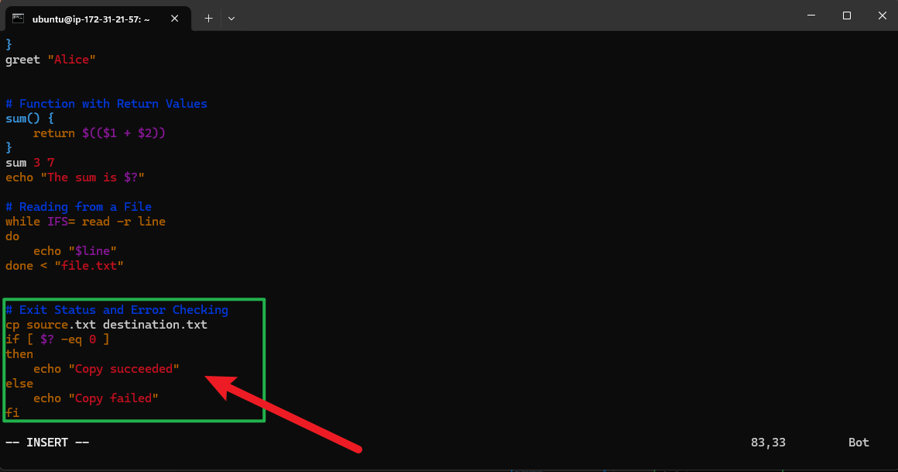

### Here's a breakdown of each line of Exit Status and Error Checking:

cp source.txt destination.txt: 
Copies the file source.txt to destination.txt.

`if [ $? -eq 0 ]`: 
Check if the exit status of the cp command (stored in $?) is 0, indicating success.

`then`: 
Begins the block of code to execute if the condition is true.

`echo "Copy succeeded"`: 
Prints "Copy succeeded" if the cp command was successful.

`else`: Begins the block of code to execute if the condition is false.

`echo` "Copy failed": 
Prints "Copy failed" if the cp command failed.

`fi`: 
Ends the if-else statement block.

The below screenshot is the confirmation of the source.txt file
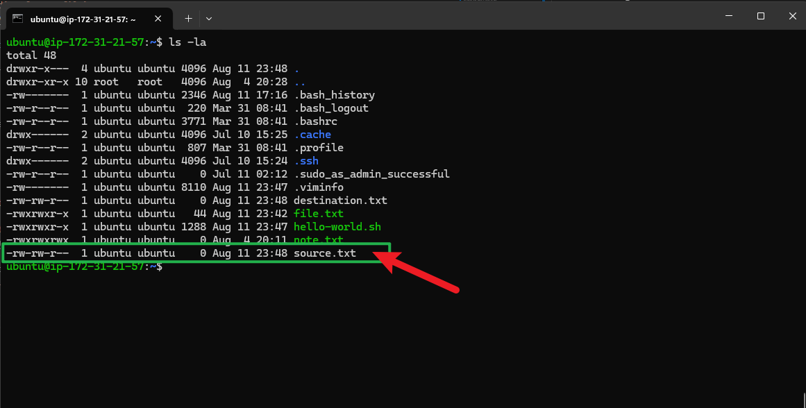

The below screenshot is the confirmation of error copy success
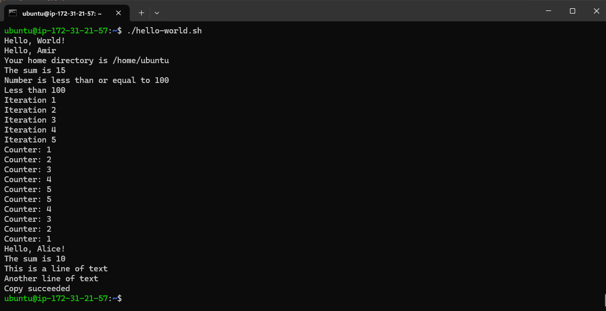
